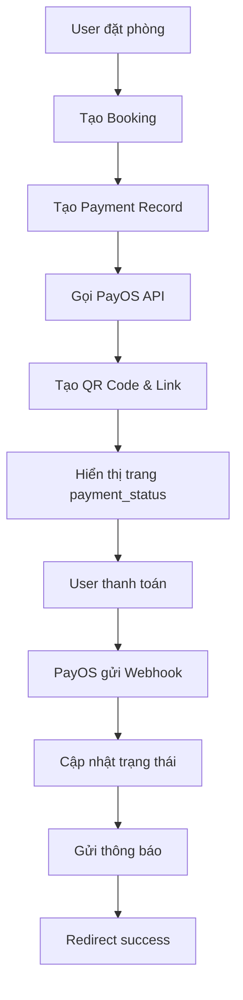

# Hệ Thống Thanh Toán PayOS - Staycation Website

## 📋 Tổng Quan

Hệ thống thanh toán tích hợp PayOS cho phép người dùng thanh toán đặt phòng homestay thông qua:
- **VietQR Code**: Quét mã QR để thanh toán
- **Chuyển khoản ngân hàng**: Nhập thông tin tài khoản
- **Link PayOS**: Thanh toán trực tiếp trên trang PayOS

## 🏗️ Kiến Trúc Hệ Thống

### 1. Các Thành Phần Chính

```
payment/
├── routes/
│   ├── payment.py          # Routes thanh toán chính
│   ├── payment_api.py      # API endpoints
│   └── webhook_handler.py  # Xử lý webhook từ PayOS
├── services/
│   └── payos_service.py    # Tích hợp PayOS API
├── utils/
│   ├── payment_utils.py    # Tiện ích thanh toán
│   └── notification_service.py # Gửi thông báo
└── models/
    └── models.py           # Models Payment, PaymentConfig
```

### 2. Luồng Thanh Toán



## 🔧 Cài Đặt & Cấu Hình

### 1. Cài Đặt Dependencies

```bash
pip install -r requirements.txt
```

### 2. Cấu Hình PayOS

Tạo file `.env` với các thông tin PayOS:

```env
PAYOS_CLIENT_ID=your_client_id
PAYOS_API_KEY=your_api_key
PAYOS_CHECKSUM_KEY=your_checksum_key
APP_BASE_URL=http://localhost:5000
```

### 3. Cấu Hình Email (Tùy chọn)

```env
SMTP_SERVER=smtp.gmail.com
SMTP_PORT=587
SMTP_USERNAME=your_email@gmail.com
SMTP_PASSWORD=your_app_password
```

### 4. Khởi Tạo Database

```bash
# Tạo migration
flask db init
flask db migrate -m "Initial payment tables"
flask db upgrade

# Chạy script setup
python scripts/setup_payos_credentials.py
```

## 📱 Sử Dụng

### 1. Tạo Payment

```python
from app.routes.payment import process_payment

# Tạo payment cho booking
payment = process_payment(booking_id)
```

### 2. Kiểm Tra Trạng Thái

```python
from app.routes.payment import check_payment_status

# Kiểm tra trạng thái payment
status = check_payment_status(payment_id)
```

### 3. Xử Lý Webhook

```python
from app.routes.webhook_handler import payos_webhook

# Webhook endpoint tự động được gọi bởi PayOS
# Không cần gọi thủ công
```

## 🔌 API Endpoints

### Payment Routes

| Endpoint | Method | Mô tả |
|----------|--------|-------|
| `/payment/checkout/<booking_id>` | GET | Trang checkout |
| `/payment/process_payment` | POST | Tạo payment |
| `/payment/status/<payment_id>` | GET | Trang trạng thái |
| `/payment/refresh-status/<payment_id>` | GET | API kiểm tra trạng thái |
| `/payment/success/<payment_id>` | GET | Trang thành công |
| `/payment/failed/<payment_id>` | GET | Trang thất bại |

### Webhook Endpoints

| Endpoint | Method | Mô tả |
|----------|--------|-------|
| `/webhook/payos` | POST | Nhận webhook từ PayOS |
| `/webhook/test` | POST | Test webhook |
| `/webhook/health` | GET | Health check |

## 🎯 Tính Năng Chính

### 1. Tự Động Cập Nhật Trạng Thái

- **Frontend Polling**: Kiểm tra trạng thái mỗi 5 giây
- **Webhook Processing**: Cập nhật real-time khi PayOS gửi webhook
- **Database Sync**: Đồng bộ trạng thái giữa PayOS và database

### 2. Thông Báo Tự Động

- **Email Notifications**: Gửi email xác nhận cho renter và owner
- **Web Notifications**: Hiển thị thông báo real-time trên web
- **Payment Status Updates**: Cập nhật trạng thái booking

### 3. Bảo Mật

- **Signature Verification**: Xác thực webhook từ PayOS
- **User Authorization**: Kiểm tra quyền truy cập payment
- **Data Encryption**: Mã hóa thông tin nhạy cảm

## 🛠️ Development

### 1. Chạy Development Server

```bash
python app.py
```

### 2. Test Payment Flow

```bash
# Tạo dữ liệu test
python scripts/create_test_data.py

# Test webhook (cần server đang chạy)
curl -X POST http://localhost:5000/webhook/test \
  -H "Content-Type: application/json" \
  -d '{"test": "data"}'
```

### 3. Debug Mode

```bash
export FLASK_ENV=development
export FLASK_DEBUG=1
python app.py
```

## 📊 Monitoring & Logging

### 1. Log Files

- **Payment Logs**: `logs/payment.log`
- **Webhook Logs**: `logs/webhook.log`
- **Error Logs**: `logs/error.log`

### 2. Database Queries

```sql
-- Xem tất cả payments
SELECT * FROM payment ORDER BY created_at DESC;

-- Xem payments pending
SELECT * FROM payment WHERE status = 'pending';

-- Xem payments thành công hôm nay
SELECT * FROM payment 
WHERE status = 'success' 
AND DATE(paid_at) = CURDATE();
```

## 🚨 Troubleshooting

### 1. Webhook Không Hoạt Động

**Triệu chứng**: Payment không cập nhật trạng thái

**Giải pháp**:
```bash
# Kiểm tra webhook URL
echo "Webhook URL: https://yourdomain.com/webhook/payos"

# Test webhook endpoint
curl -X POST https://yourdomain.com/webhook/health

# Kiểm tra logs
tail -f logs/webhook.log
```

### 2. QR Code Không Hiển Thị

**Triệu chứng**: QR code không load được

**Giải pháp**:
```bash
# Kiểm tra PayOS credentials
python scripts/check_payos_credentials.py

# Test PayOS API
python scripts/test_payos_connection.py
```

### 3. Email Không Gửi Được

**Triệu chứng**: Không nhận được email xác nhận

**Giải pháp**:
```bash
# Kiểm tra SMTP config
python scripts/test_email_config.py

# Test gửi email
python scripts/test_notification.py
```

## 📈 Performance

### 1. Optimization Tips

- **Caching**: Cache QR codes và payment info
- **Async Processing**: Xử lý webhook bất đồng bộ
- **Database Indexing**: Index trên payment fields

### 2. Monitoring Metrics

- **Payment Success Rate**: Tỷ lệ thanh toán thành công
- **Webhook Response Time**: Thời gian xử lý webhook
- **QR Code Load Time**: Thời gian load QR code

## 🔄 Updates & Maintenance

### 1. Cập Nhật PayOS SDK

```bash
pip install --upgrade payos-sdk
```

### 2. Database Migration

```bash
flask db migrate -m "Update payment schema"
flask db upgrade
```

### 3. Backup Database

```bash
mysqldump -u username -p database_name > backup.sql
```

## 📞 Support

### 1. PayOS Documentation
- [PayOS API Docs](https://docs.payos.vn/)
- [Webhook Guide](https://docs.payos.vn/webhook)
- [QR Code Integration](https://docs.payos.vn/qr-code)

### 2. Internal Support
- **Developer**: [your-email@company.com]
- **Technical Lead**: [tech-lead@company.com]
- **Project Manager**: [pm@company.com]

---

**Lưu ý**: Đây là tài liệu internal. Không chia sẻ thông tin nhạy cảm ra ngoài. 